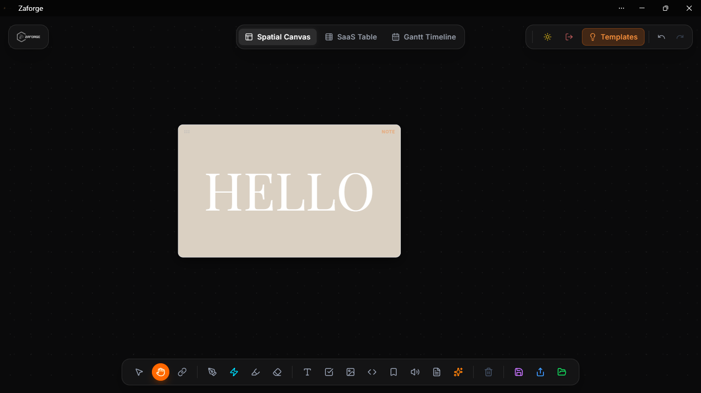

# ✦ Zaforge
> **"A minimalist canvas for infinite thoughts."**



[](https://reactjs.org/)
[](https://vitejs.dev/)
[](https://tailwindcss.com/)
[](https://supabase.com/)
[](https://greensock.com/)

Zaforge is an award-tier, polymorphic node-graph productivity tool. It breaks the boundaries of traditional linear documents by giving you an infinite spatial canvas to structure your ideas, map out complex architectures, and track project timelines. Designed with an ultra-premium UI, custom typography, and hardware-accelerated physics.

---

## 🚀 Core Features

1. **Polymorphic Views**: Your data isn't trapped in one paradigm. Seamlessly switch between three synchronized modes instantly:
   - **Spatial Canvas**: An infinite node-graph where you can drag, connect, and arrange thoughts organically.
   - **Table View**: A structured, database-like overview of your nodes for quick data entry and property management.
   - **Gantt View**: A timeline view to track task velocities, start dates, and deadlines.
2. **Local-First Sync Engine**: Your workflow should never stop for a loading spinner. Zaforge is built with a robust optimistic UI, local caching, and background Supabase replication.
3. **Cinematic 60 FPS Physics**: Powered by GSAP and Lenis, experience buttery-smooth dragging, inertia, magnetic hovering effects, parallax scrolling, and native scroll-scrubbing.
4. **Rich Nodes**: Support for Notes, Tasks (with interactive subtasks), Images, and inline PDF viewing.
5. **Command Palette**: A global shortcut system (`Ctrl+K` / `Cmd+K`) to quickly execute actions and navigate the app without touching your mouse.
6. **Premium UI/UX**: Featuring custom Audex typography, abstract scroll-linked SVG animations, and bespoke scrollbars that match the minimalist dark aesthetic.

---

## 🛠 Tech Stack

- **Framework**: React + Vite
- **State Management**: Zustand (Global Store & Undo/Redo History Stack)
- **Backend & Auth**: Supabase (Postgres, Magic Links, OAuth)
- **Physics & Animation**: GSAP (ScrollTrigger, Draggable, Inertia, MotionPath) + Lenis
- **Styling**: Tailwind CSS (Custom color palettes and utility tokens)

---

## 📖 Tutorial & User Guide

### 1. Getting Started (Local Development)
To run Zaforge locally, follow these steps:
```bash
# Clone the repository
git clone https://github.com/your-username/zaforge.git
cd zaforge

# Install dependencies
npm install

# Setup Environment Variables
# Create a .env file in the root directory and add your Supabase keys:
VITE_SUPABASE_URL=your_supabase_project_url
VITE_SUPABASE_ANON_KEY=your_supabase_anon_key

# Start the development server
npm run dev
```

### 2. Authentication Flow
Zaforge uses passwordless authentication. Click **Sign In** on the landing page, enter your email, and a secure Magic Link will be sent to your inbox. Google OAuth is also natively supported. 

### 3. Mastering the Canvas
- **Spawning Nodes**: Double-click anywhere on the empty canvas to spawn a new note, or press `Cmd+K` to open the Command Palette and select a specific node type.
- **Physics Dragging**: Click and drag any node. When you let go, GSAP Inertia will naturally glide the node to a stop.
- **Connecting Ideas**: Hover over a node to reveal its connection ports. Click and drag from one port to another to draw a dependency arrow.
- **Undo / Redo**: Made a mistake? Standard `Ctrl+Z` and `Ctrl+Shift+Z` shortcuts are deeply integrated into the Zustand history stack.

---

## 🏗 Architecture Deep-Dive

For developers looking to contribute, here is how the core systems interact:

### The Sync Engine (`lib/syncEngine.js`)
Zaforge implements a **Local-First Architecture**. When a user modifies a node, the change is written to the Zustand store immediately. The UI updates instantly. The Sync Engine then intercepts this payload, caches it locally if offline, and places it in a background queue to be debounced and replicated to the Supabase Postgres database. 

### Zustand State Tree (`store/usePlannerStore.js`)
The entire application state (cards, connections, user session) lives in a single Zustand store. To handle time-travel (Undo/Redo), the store maintains a `past` array and a `future` array. Every time a destructive or significant action occurs (like moving a node or deleting a connection), a snapshot of the current state is pushed to the `past` stack.

### GSAP Contexts (`useGSAP`)
Because Zaforge is highly dynamic, standard CSS transitions aren't enough. We rely on GSAP's `@gsap/react` plugin. Every physics interaction (draggable nodes, scroll triggers) is wrapped in a `useGSAP` hook scoped to a specific React `ref`. This ensures that when a component unmounts, the physics engine perfectly cleans up its memory footprint, preventing memory leaks during rapid View switching.

---

## 🤝 Contributing
We welcome contributions! Please check the issues tab to see what features are currently on the roadmap (e.g. Realtime Multiplayer Cursors, Infinite Canvas Zooming).

*Designed and engineered with passion. Zaforge.*
